****

**《应用软件与管理实践》**

**实习报告**

**（2023）**

**题  目： “医云”医疗信息综合服务平台**

**专  业：   信息管理与信息系统**

**指导老师：    徐德华**

**小  组：   第4组**

**成  员：   [2153874] [谭楷蓁]**

**[2151825] [陶志城]**

**[2151675] [王嘉赋]**

**[2153874] [张宇豪]**

**[2153097] [许子鸣]**

**日  期：  2023.07.30**

**目录**

**1、设计背景和目的3**

1.1、设计背景3

1.2、设计目的4

**2、需求收集与分析4**

2.1、需求收集4

2.1.1、病人患者4

2.1.2、小型诊所4

2.1.3、三甲医院4

2.2、需求分析5

**3、前端设计5**

3.1、概述5

3.2、功能5

3.3、使用逻辑6

3.3.1、导航栏6

3.3.2、主页7

3.3.3、登录与注册页面8

3.3.4、我的主页9

3.3.5、信息公开页面10

3.3.6、医院推荐页面12

3.3.7、社区论坛13

3.4、技术与框架14

3.4.1、Bootstrap14

3.4.2、HTML+CSS+Javascript15

**4、后端设计15**

4.1、数据库设计15

4.1.1、需求分析（数据库功能）15

4.1.2、ER图15

4.1.3、逻辑结构设计16

4.1.4、数据库展示16

4.2、技术与框架20

4.2.1、Django框架简介20

4.2.2、MTV模式20

4.2.3、URL设计22

4.2.4、文件架构22

4.3、前后端数据交互23

**5、技术创新23**

5.1、数据获取处理与Python爬虫23

5.2、高德地图API调用23

1.  **实习体会、分工与贡献度24**

    6.1、实习体会24

    6.2、分工28

    6.3、贡献度28

1、设计背景与目的

1.1 设计背景

作为具有巨大人口基数的国家，随着我国经济与科技水平的不断进步，人民的生活质量日渐提高，相应地，人民的医疗服务需求也愈发重要。不仅如此，人们的医疗需求形式也变得更为多元：它不再局限于传统的线下挂号、取号、咨询门诊的形式，而增加了更为先进的线上大数据元素，在疫情前，我国的健康医疗大数据市场规模就在以极高的增速扩张着：每年都有着不少于35%的增速，早在2019年就已经达到了78亿元的规模。

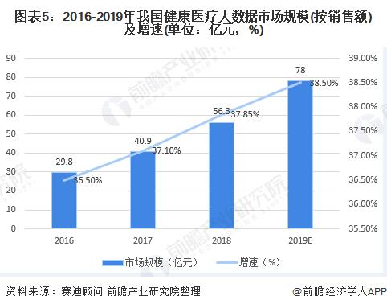

**图1：2016-2019年我国健康医疗大数据市场规模（按销售额）**

**及增速（单位：亿元，%）**

即使在疫情之后，我国的医疗卫生服务需求仍然呈现非常稳定的增长趋势，根据中国中央人民政府卫生健康委网站统计，2021年我国的医疗卫生机构床位数已达到944.8万张，实现五年连续稳定增长。从另一数据：全国卫生技术人员数也能得到非常一致的结论，这意味着医疗服务在当下，更在未来，始终具有极为重要的探索价值。

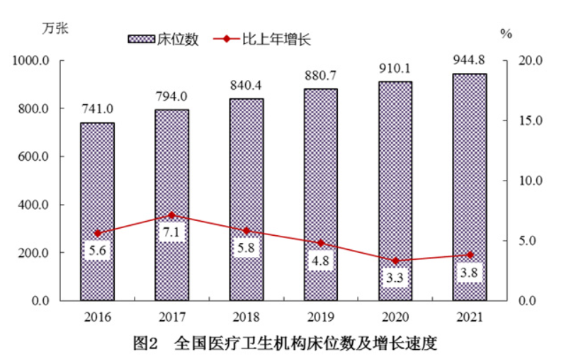

**图2：全国医疗卫生机构床位数及增长速度**

**图3：全国卫生技术人员数**

然而，我们注意到：在目前的医疗服务领域，对于就医的建议，缺少一个真正权威的，信息全面的平台。市民朋友时常会遇到身体不适，需要前往医院就诊的情况。这时，如果我们去直接参考百度上的“竞价排名”，或是听信了亲人朋友的不靠谱建议，在费时费力的同时，可能会因信息的不准确，导致治疗效果不佳，进而产生严重的后果。出于这个问题，我们开发了“医云”医疗信息综合服务平台网站。

1.2 设计目的

“医云”致力于打造一个真正服务于广大市民的医疗信息综合服务平台。我们聚焦高水平的三甲医院，通过提供权威的医疗建议和全面的医疗信息，我们希望能够解决市民在就医过程中遇到的信息不对称问题，让他们能够安心就医，获得更好的治疗效果。通过个性化的医疗个性化推荐功能，我们希望能够帮助两类人群，一类是已接受其他网站的网络就诊，确定疾病后的病人；另一类是医疗器械水平有限的小型诊所，如果他们遇到相关疑难杂症无法解决，可以使用我们的网站进行高水平三甲医院的推荐并办理转院流程，提高就医的便捷性和效率，为用户提供更好的医疗体验。

2、需求收集与分析

2.1 需求收集

2.1.1 病人患者

非常多的病人患者由于时间或金钱成本的问题，无法多次前往线下医院就诊而只能在初步诊断时选择线上的咨询就诊。在大致了解了自己的病症之后，他们又无法得到具体有效的解决措施，因而需要效率较高的线下门诊。这类广大人群对权威信息与高效就医的需求必须被重视也有待探索。

2.1.2 小型诊所

小型诊所能够应对的往往是生活化的疾病，面对严重的恶性病症，它们既没有足够的经验也没有相应的专业器械能够给予居民充分全面的医疗服务。在遇到患有严重疾病的患者时，小型诊所应当如何解决自身医疗水平与患者迫切需求的矛盾，这何尝不是一种冷门却又值得关注的需求呢？

2.1.3 三甲医院

对于医疗经验丰富且器械资源雄厚的三甲医院来说：发现更多病人，用自己的医疗卫生服务帮助更多患者是最重要的责任。如何更高效地利用到互联网资源，有针对性地放大医院自身强项的优势——合适的渠道便是一种需求。

2.2 需求分析

现有的医疗服务领域，在就医咨询方面并没有一个针对三甲医院，公开透明的权威信息平台。对于需要高效就医的患者，若选择参考百度等网站的“竞价排名”，抑或是相信亲朋好友的个人推荐，这都使患者被暴露在医疗信息不对称的问题中。这样的问题，轻则导致治疗结果不理想，重则导致一条鲜活生命的逝去对于小型诊所来说，无法处理的疾病始终是棘手的难题，是萦绕在诊所正常运营头顶的长存乌云。大型的三甲医院则非常希望更有效率地利用自己的医疗资源，承担社会责任。

综上，我们决定创建一个具备权威信息、个性化推荐与交流社区的综合医疗信息平台，它可以在多个角度直击医疗信息不对称的问题，希望能够更好地服务于广大市民，为每个人的健康保驾护航。

3、前端设计

3.1 概述

我们的网站名为“医云”，这个简洁的名称点明了我们这一项目的两大要素：“医”是聚焦上海市内三甲医院，构建服务于广大市民的医疗信息综合服务平台，为市民提供一定的医疗信息及定制化医疗建议；而“云”则是基于互联网技术为广大用户提供便利快捷的服务，消减地理、硬件等环境的制约，惠及全部用户。

我们的logo也全面展现了我们的设计理念：作为logo主体的十字代表着“爱与救赎”，这也是我们的设计初衷；其周围的八个小图案则以各类器械为意象，表现着医疗这一核心主题。Logo的主体颜色为蓝白色，其为医疗领域的常用配色，表现出生命感与庄严洁净，整体显得美观大方而不失亲切感，契合我们的设计主旨。

在以上设计理念的基础上，网页前端实现了头部导航、注册与登录、个人信息中心、首页、医院信息检索、医院智能推荐、社区论坛等功能，不同的页面从美工、信息展览及交互等多方面连结，形成了完整的服务网站，接下来我们将进一步讲述各个部分具体实现的功能。

3.2 功能

“医云”的功能板块主要分为个人主页、信息公开、智能推荐及社区论坛四个部分。同时具有注册登录板块。个人主页板块需要进行注册或登录后才能使用，其他三个板块则为我们这一网站的主要功能，可通过主页的功能入口或各个页面的导航栏进入。

个人主页板块用于登记和修改个人信息，包括基本身份信息及住址等，该信息将被用于智能推荐模块；其次，用户还可以在个人主页查看过往收藏的医院信息和帖子等，并快速跳转至该页面以查看详细内容；除此以外，用户还可以在个人主页模块查看自己过去发布了的帖子，可对帖子内容及帖内回复进行修改或删除，并可快速跳转至该帖页面。

信息公开页面则以上海市各个区为划分，展示各个区具有的三甲医院及其简要信息，同时用户也可在搜索框输入医院关键词或地区等检索相关的医院信息，进一步地用户可以通过点击某一医院的简要信息进入该医院页面获取详细信息，包括医院简介、地址、联系方式及特色科室等。除此以外，用户还可在医院详细信息页面对医院进行收藏，以后可通过个人主页直接访问该医院的详细页面。

智能推荐模块可以帮助用户根据病症及用户的地理位置综合推荐在相关疾病治疗上具有优势且邻近的三甲医院。用户可通过疾病首字母检索相关病症或直接输入搜索，从而选择本次服务要确定的病症；而地址位置选择提供两种方式，默认地址即为用户在个人主页登记的地址，用户也可手动输入即时地址。点击推荐后用户即可获取按远近排序的医院推荐，并获取其详细信息，为诊疗做好预先准备。

社区论坛则为网站用户提供公开的交流平台，用户可在首页浏览论坛内的帖子或通过检索获取感兴趣的内容，浏览帖子详细内容时可收藏并在帖下留言。用户也可以发布属于自己的帖子，并在个人主页模块对其进行修改或删除留言等。

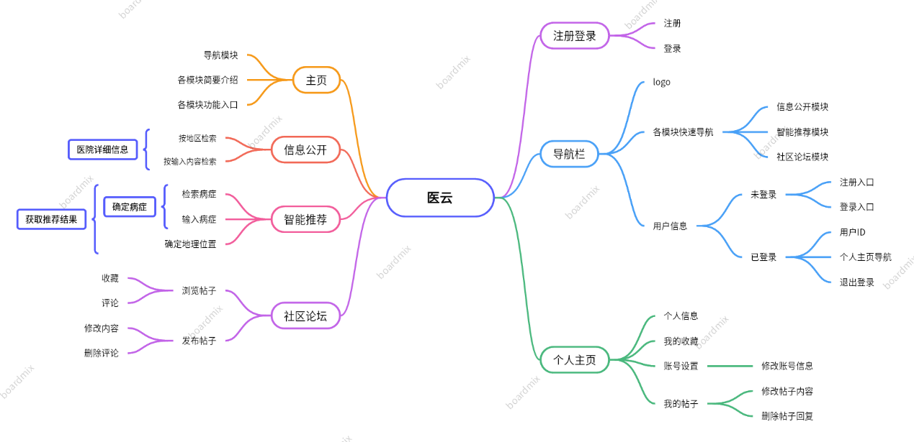

3.3 使用逻辑

3.3.1导航栏

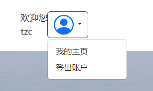 导航栏出现在每一个页面上，方便用户实现功能间的快速切换。导航栏分为三块，分别是左边的logo、中间的功能模块和右边的登录注册状态，用户未登陆时右侧显示登录/注册按钮，登录后显示欢迎语句和头像图标，当用户点击头像图表后会出现和用户相关的功能——我的主页和登出账户。

3.3.2主页

 网站主页主要介绍了我们的理念和我们的优势所在，同时给出了网站的三个核心模块的跳转，方便用户了解上手我们的功能使用。

3.3.3 登录与注册页面

当用户进入我们的网站时，需要点击右上角的登录注册按钮，此时会跳转到登录界面，在文本框里输入正确的账号和密码即可开始使用网站。

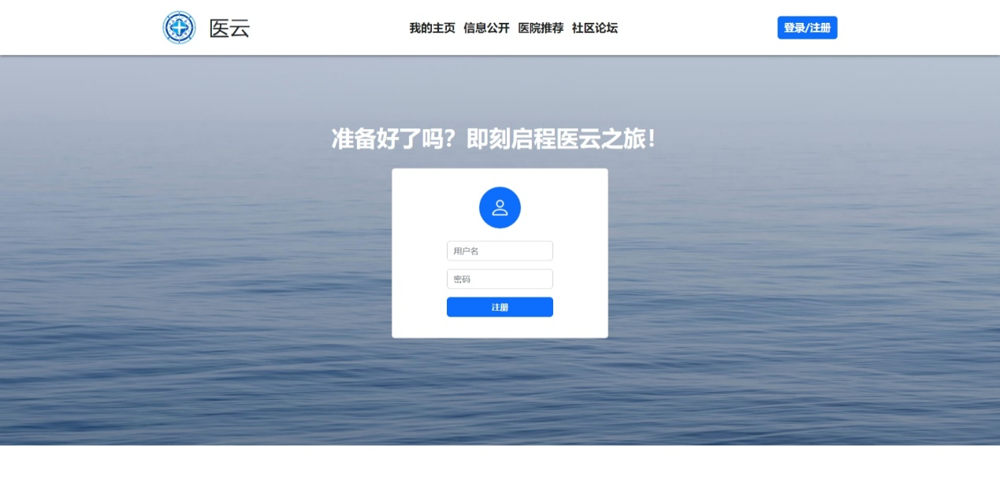如果用户尚未拥有账号，需要点击登录按钮下方的“点击注册”进行账号注册，在此页面用户输入想要设置的用户名和密码，点击注册按钮注册成功后即可回到登录界面，登录后就可以使用网站功能。如果用户名已被注册则会在注册时提示。

3.3.4我的主页

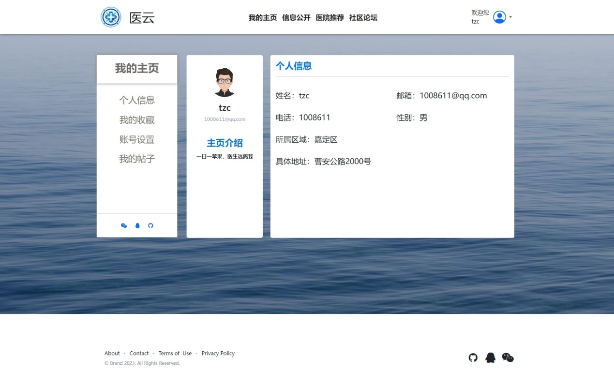我的主页中有个人信息、我的收藏、账号设置和我的帖子四个页面。个人信息页面主要展示用户的个人信息；收藏页面记录了用户收藏的医院信息和收藏的帖子，当用户点击时会跳转到相关的页面；账号设置页面为用户提供了个人信息的修改方式；我的帖子页面则记录了用户发布的帖子和对论坛中帖子的回复内容，用户可以通过这里对帖子与回复内容进行修改和删除，点击时会跳转到相关页面。

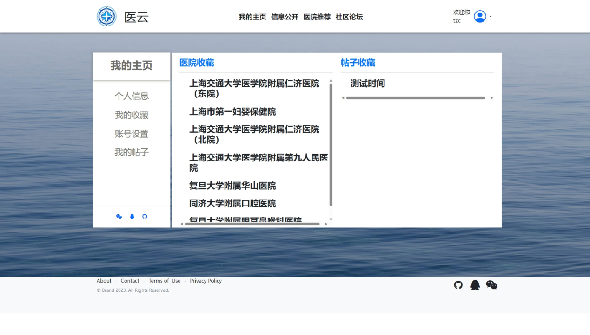

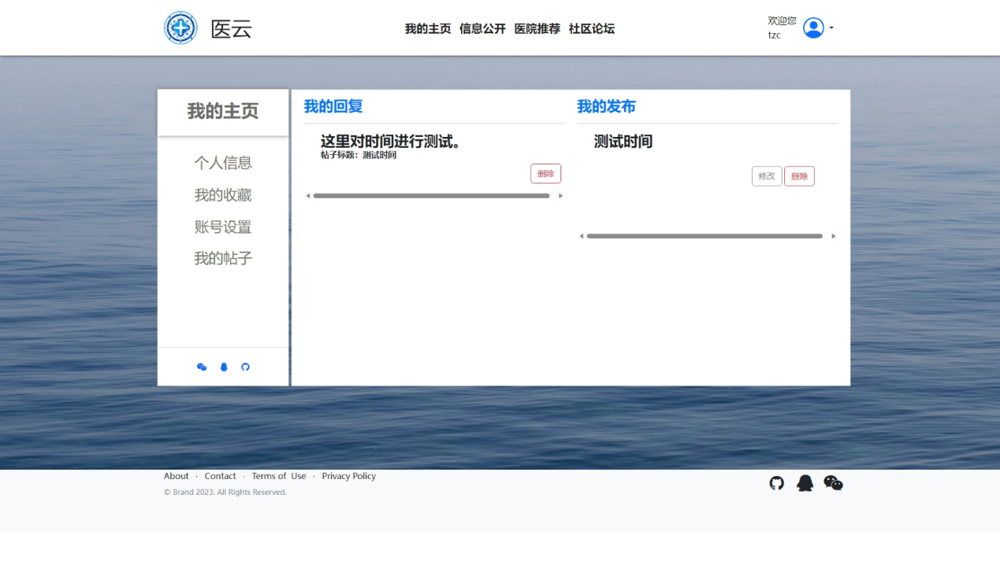

3.3.5信息公开页面

信息公开页面主要对上海市所有的三甲医院信息进行介绍，方便用户对医院信息拥有简明扼要的了解。在这个页面用户可以对医院的名字进行搜索，搜索框中输入关键字后，相关的医院便会陈列在下方，同时用户也可以通过点击左侧地区或搜索框输入地区就可以按照地区划分获得不同地区的医院信息。在看到医院的简要信息后，用户可以点击该医院进入医院信息介绍的详细界面获得更多信息，在医院信息的详细介绍页面还有收藏功能，可以将该医院的信息收藏到个人主页，方便用户的下次查看。

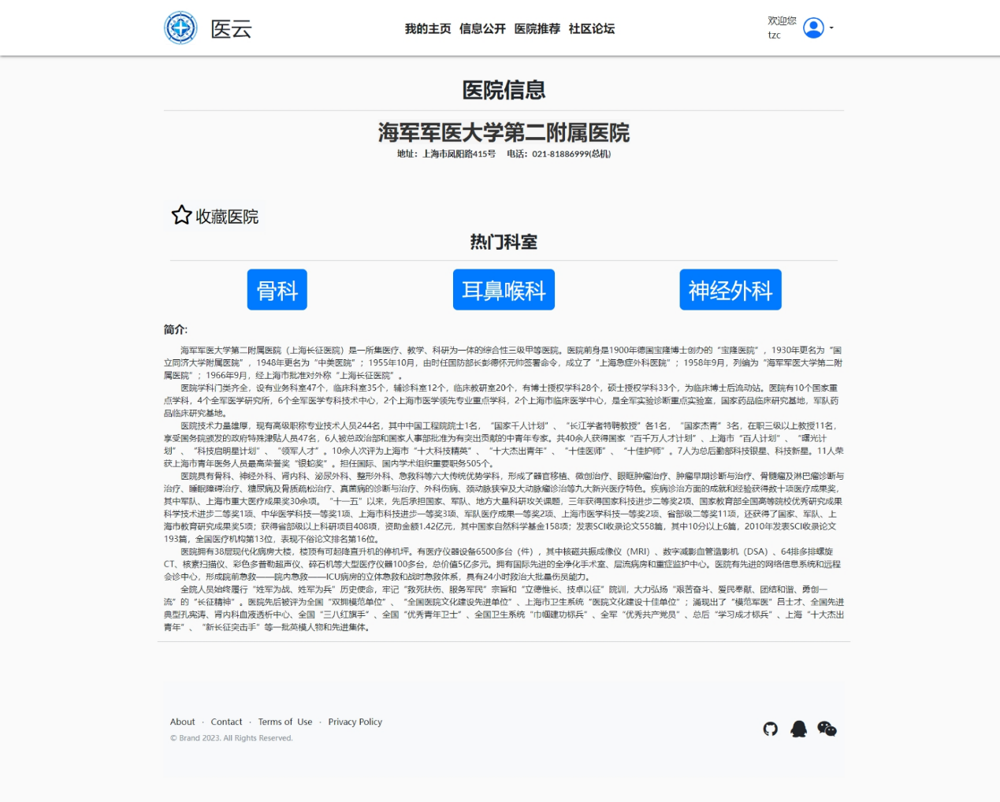

3.3.6医院推荐页面

 医院推荐界面可以帮助用户根据病症推荐在相关疾病治疗上具有优势的三甲医院。用户需要先对病症进行选择，可以通过左侧的字母检索表确定病症，也可以通过下方的搜索框进行搜索，当用户病症确定后，可以在上方的搜索框里按照区+街道的格式输入所在地址，如果选择默认地址，则直接调用用户个人主页所填写的地址，之后点击搜索医院，推荐的医院就会按照距离的远近依次排列供用户选择，同时用户可以点击医院跳转到医院的详细介绍，为到医院看病做好准备。

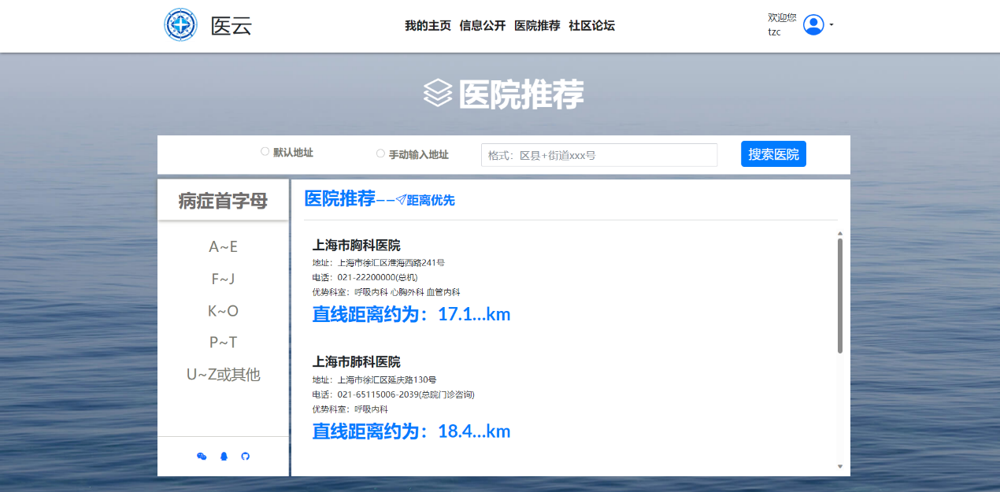3.3.7 社区论坛

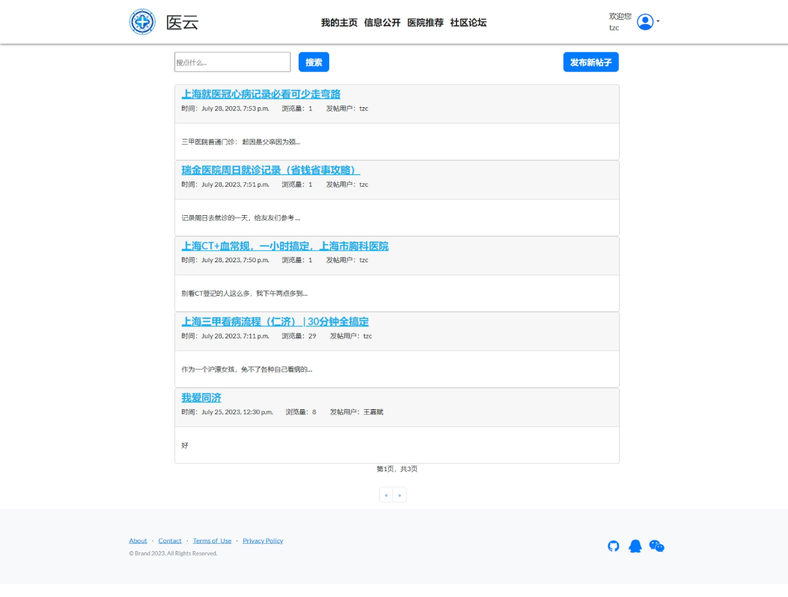 社区论坛页面由不同用户发布的帖子组成，页面的左上角有搜索框，方便用户检索自己感兴趣的医疗相关的帖子；在页面的右上角有发布新帖子按钮，点击此处即可创建一篇新的帖子。在社区论坛页面展示简略的帖子信息，包括标题、发帖用户、创建时间、浏览量以及帖子内容的部分，页面的下方有翻页按钮，方便用户查看更多帖子，用户点击帖子标题将跳转到对应帖子的详情页面，可以查看帖子的全部内容。在帖子详情页面，用户可以在帖子下方进行评论交流，也可以点击收藏按钮收藏帖子，方便及时追踪帖子的最新动态。

3.4 技术与框架

本组前端技术主要基于BootStrap5.0实现，主要使用的是Bootstrap studio。

3.4.1 Bootstrap

本项目使用bootstrap框架进行前端的构建。Bootstrap是由 Twitter 发布并开源的前端框架。其具有以下特点：首先bootstrap提供了一套基于栅格系统的响应式设计，可以自动适应不同分辨率的屏幕大小，从而让网站或应用程序在不同设备上呈现出最佳的效果，利用分列的组合排列实现各种复杂布局；其次它提供了一系列的CSS、JavaScript和HTML组件，包括表单、按钮、导航、排版、模态框等等，避免了重复造轮子的繁琐，具有易用性；除此以外它还提供了大量的CSS变量和Sass变量，这些变量可以让开发者轻松地定制Bootstrap的外观和行为，例如颜色、边框、阴影等，从而满足不同类别项目的需求，具有较高的灵活性和可定制化程度。

另外，在本项目的构建过程中，我们还使用了bootstrap studio，它是在Chrome浏览器代码和 Node.js 基础之上重组和整理出的一套很规范的基于Bootstrap框架的网页前端设计工具，其中Chrome内核被改造成了其效果呈现器，Node.js则作为程序逻辑控制及页面在浏览器上测试效果用的http服务器。它包括了组件面板、概述面板、编辑器面板、设计面板、选项面板等多个功能区域，可对网页进行便捷的可视化编辑，快速完成网页的大体框架设计。在我们项目的构建过程中，我们利用bootstrap studio对页面进行架构和设计，从而较为便利地得到大致页面，进而能够将更多时间花在调试及具体部分的完善和后续修改。通过使用bootstrap框架及bootstrap studio，我们得以较好地实现页面建设及其完善，在一定程度上加快了项目的构建速度并提高了项目质量。

3.4.2 HTML+CSS+Javascript

本项目前端开发使用了传统的HTML+CSS+Javascript模式。

其中HTML 英文全称是 Hyper Text Markup Language，意为“超文本标记语言”。它不是编程语言，没有逻辑处理能力，没有计算能力，不能动态地生成内容，而只能静态地展示网页信息。它通过不同的标签来标记不同的内容、格式、布局等。HTML文本

是由HTML命令组成的描述性文本，HTML命令可以说明文字，图形、动画、声音、表格、链接等。而超链接是互联网的纽带，它能将众多网页连接起来，让它们交织在一起，形成一张“网”，从而实现网上信息资源的连接，方便用户访问和使用。

CSS全称Cascading Style Sheets，意为层叠样式表，是一种用来表现HTML（标准通用标记语言的一个应用）或XML（标准通用标记语言的一个子集）等文件样式的计算机语言。CSS不仅可以静态地修饰网页，还可以配合各种脚本语言动态地对网页各元素进行格式化。CSS 能够对网页中元素位置的排版进行像素级精确控制，支持几乎所有的字体字号样式，拥有对网页对象和模型样式编辑的能力。

JavaScript是一种具有函数优先的轻量级，解释型或即时编译型的编程语言。其作为开发Web页面的脚本语言而出名，同时它也被用到了很多非浏览器环境中。JavaScript基于原型编程、多范式的动态脚本语言，并且支持面向对象、命令式、声明式、函数式编程范式。通常JavaScript脚本是通过嵌入在HTML中来实现自身的功能的，但也可写为单独的js文件，具有跨平台的特性。

4、后端设计

4.1 数据库设计

4.1.1需求分析（数据库功能）

本项目采用 mysql 数据库。结合不同用户类型的需求，以及本网站实现的功能，我们

归纳出数据库功能如下：

（1）用户注册后储存用户的用户名与密码，在下次登陆时判断信息是否正确。

（2）储存用户的基本信息，包括名称，性别，用户邮箱，用户地址，用户电话等以实现信息公示和医院推荐等后续功能。

（3）用户发布帖子，数据库来记录帖子的标题、创建时间、内容、创建对象等信息来实现用户对帖子的访问和管理员的管理。

（4）用户可以收藏其他用户的帖子，数据库可以记录收藏信息并在用户的收藏夹中查看。对于帖子用户也可以发表评论，数据库会记录发表评论的内容，时间，发出用户等基本信息。

（5）数据库中会存储医院的名称，联系电话，地址，简介，优势科室等信息，能够实现三甲医院的基础信息公开。

（6）数据库中储存了不同病对应的科室和拼音首字母，便于用户实现对病的快速查找，同时方便系统进行病名科室对应，从而实现优势科室医院的推荐功能。

4.1.2 ER图

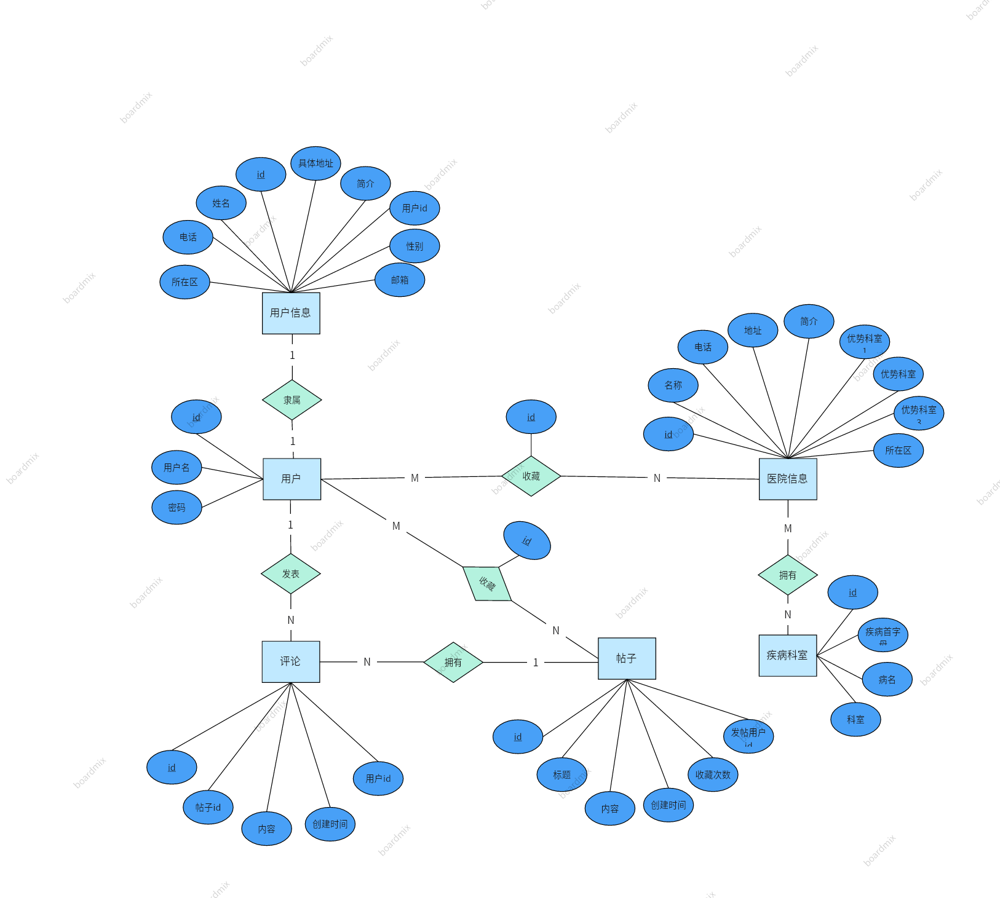

4.1.3 逻辑结构设计

数据库的逻辑结构设计：把概念结构设计阶段设计好的基本实体—联系图转换为与选用

的数据库管理系统产品所支持的数据模型相符合的逻辑结构。

优化后的三范式如下：

1.  用户（id，用户名，密码）
2.  用户信息（id，姓名，性别，电话，邮箱，所在区，具体地址，简介，用户id）

3、医院信息（id，名称，电话，地址，简介，优势科室1，优势科室2，优势科室3，所在区）

4、疾病科室（id，疾病首字母，病名，科室）

5、帖子（id，标题，内容，创建时间，收藏次数，发贴用户id）

6、评论（id，评论内容，创建时间，帖子id，用户id）

7、医院收藏（id，医院id，用户id）

8、帖子收藏（id，帖子id，用户id）

4.1.4数据库展示

用户表

用户信息表

帖子收藏表

医院收藏表

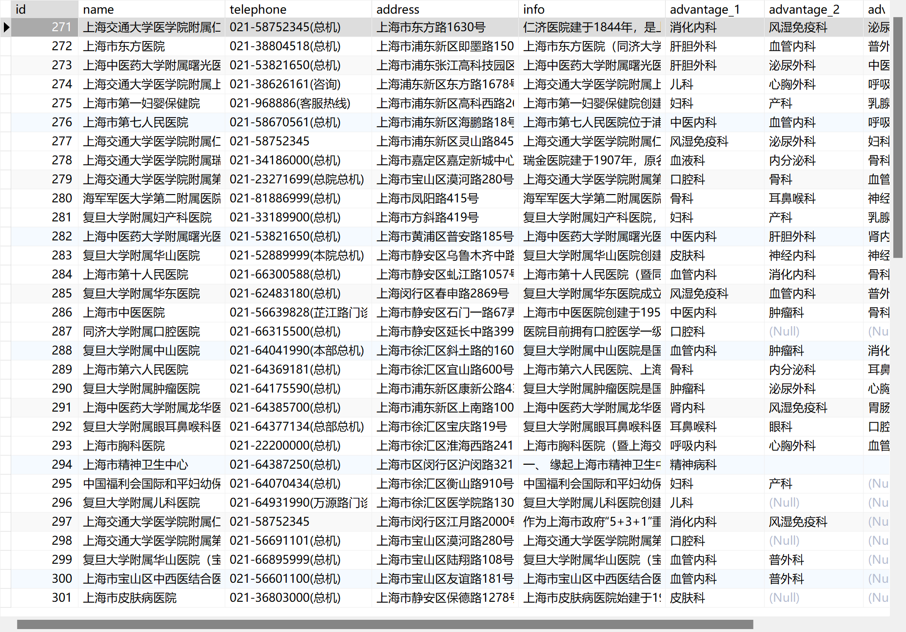

医院信息表

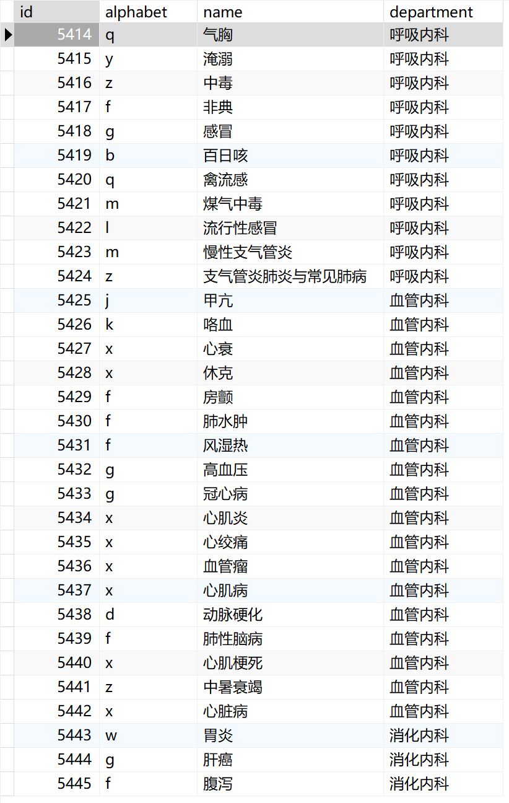

病名科室表

帖子表

帖子评论表

4.2 技术与框架

4.2.1 Django 框架简介

本小组后端主要使用了Python 3.11和Django 4.3搭建框架。

Django是一个免费且开源的高性能的Web应用框架。它是由Python写成，开发文档简洁而齐全。Django鼓励快速开发以及干净实用的设计准则，内置了大量功能，能规避web开发中的许多麻烦，让开发者专注于编写web程序的逻辑。

Django框架采用的是MTV的设计模式，即模型（Model）、视图（Views）、模板（Template），三者之间各司其职，互相配合。

4.2.2 MTV框架

1、模型（Model）：最底部的一层，是对于信息的一种模型封装与定义。它包含了要存储的必要字段和操作数据的方法。即每个模型映射了一张数据表。

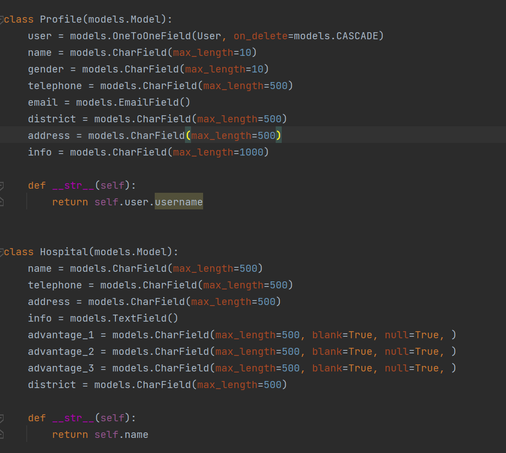

例如在上图中，class Profile即对应一张数据表，其中user到info都是表的字段。

2、视图（Views）：组成了Django应用程序里几乎所有的逻辑。它们的定义是链接到一个或多个定义URL上的Python函数，这些函数都会返回一个HTTP响应对象。视图不仅负责根据用户请求从数据库读取数据、指定向用户展示数据的方式（html或json数据），还可以指定渲染模板并处理用户提交的数据。Django为这类任务也提供了很多方便快捷的帮助函数。

例如在上图中，def hospitalinfo即是用户访问医院详情页面所执行的函数，class ModifyForm是创建/修改帖子的表单类型。

3、模板（Template）：基本上，模板就是组成网站的一系列的HTML文本，用于呈现Views传来的数据，决定了用户界面的外观。当一个视图要返回一个HTML文档时，它通常会指定一个模板，提供给它所要显示的信息，并在响应里使用模板渲染的结果。模版里面也包含了表单，可以用来搜集用户的输入内容。

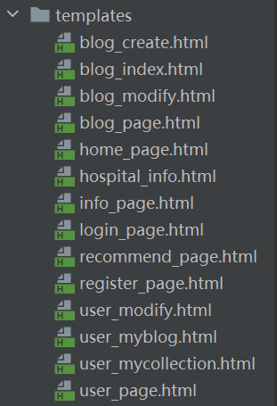

4.2.3 URL设计

首先是主页和登录注册页面，/login和/register，然后则是按照模块分类。与用户个人中心相关的路由皆由/user开头，如我的发布、我的收藏、账号设置等。与论坛相关的路由皆由/blog开头，如论坛主页、帖子详情、帖子的创建修改和删除等。信息公开和医院推荐是/info和/recommend，医院详情是/hospital_info。

本程序目前只创建了一个App名为forum，网站中的所有功能都集成于此，稍显臃肿，后续改进我们可根据相似的功能模块细化再分为几个App。

4.2.4 文件架构

在forum应用文件夹内，/static为静态文件存储目录，负责存储css、js和图片文件；/migrations存储数据迁移指令；/templates存储上文提到的诸多html文件。

urls.py存储路由；views.py 是上文提到的视图函数；models.py 是上文提到的模型文件； positon_to_distance.py 中封装的是接入地图api的函数；在admin.py内导入模型注册后，管理员即可在Django内置的后台（../admin）管理模型数据。其余则是创建Django Python项目自动生成的一些基础文件。

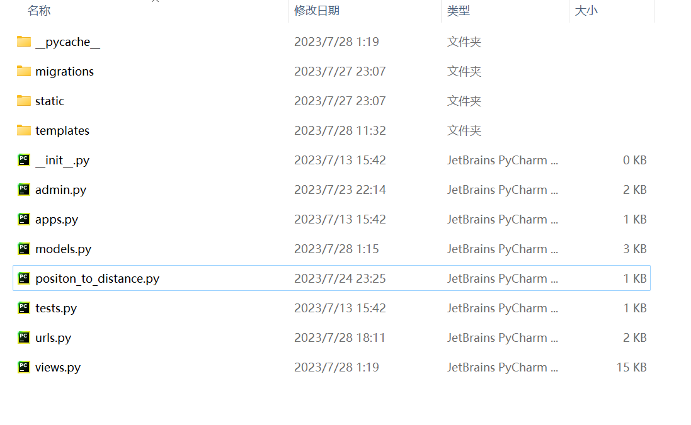

4.3 前后端数据交互

在前后端进行数据交互时，主要有GET和POST两种方式。对于数据交互的手段，我们主要采用的都是Django框架所自带的方法。例如在数据上传时，由于Django 提供的ModelForm极大地简化了这一过程，所以我们主要通过由ModelForm实例化的form对象进行。而对于数据的取出，我们主要使用的是objects.filter的方法，代替了SQL略显繁杂的查询语句，从而能更方便地得到数据，并将其放在python文件中，利用python功能强大的各种库进行处理。

5、技术创新

5.1 数据获取处理与Python爬虫

为了获取网站建设过程中的三甲医院数据，包括医院名称、医院地址、联系电话、简要介绍、优势科室等，我们采用了Python中的requests库，并辅以bs4库中的BeautifulSoup 类来实现信息获取的目的。通过对网站HTML的观察，我们用BeautifulSoup的find方法很轻松定位到了目标信息的HTML位置，借助正则表达式，我们剔除了冗余的信息，将筛选出的目标信息保存在了列表之中，并利用pandas库将信息存储到了excel文件中以便于网站后续建设中的数据调用。

5.2 高德地图API调用

综合考虑API的开放程度和地图信息丰富程度，我们最终选择高德地图的API来辅助完成相关功能。利用地图API，我们实现了对于各医院经纬度位置的定位，并在geopy库的辅助下完成了用户与各医院距离计算等功能，为用户高质量就医提供有力支持。

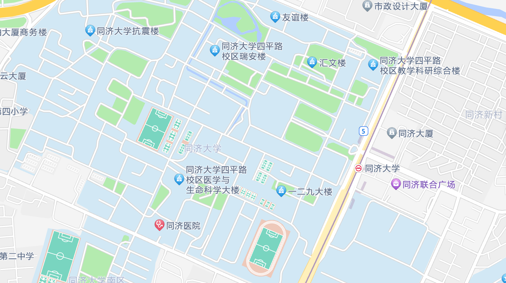

为了能够实现用户对于就医质量与便利性的双重需求，我们的网站做了如下方面的努力。对于就医质量的保证上，我们的推荐版块将利用用户选择的病名对应出科室，然后优先筛选出此科室为优势科室的医院名称以及相对应的基本信息呈现到用户眼前，用户可点击来进一步查看感兴趣医院的详细信息，保证了推荐医院的可靠性。对于用户的便利性需求，我们将通过高德地图api的调用对推荐医院列表中的医院进行定位，通过比较用户储存在数据库中的默认地址信息（若用户不在默认地址也可以选择直接输入目前地址）与各医院的距离远近，我们会对这些距离信息进行排序，并最终以从近到远的顺序呈现在用户，以实现用户对于就医便利性的需求。

5.3 服务器配置

我们租用了阿里云服务器，并将网站部署在云端，现已成功上线：101.132.100.145

6、实习体会、分工与贡献度

6.1 实习体会

2153874谭楷蓁：

这一次设计网站的小学期项目经历着实是让我受益匪浅。组长的位置在团队项目中，历来都是如烫手山芋般的存在，在无人有意愿后，我只得默默接过旗帜。小小的肩膀，承担着大大的责任。在项目初期，我们进展得还算顺利，花了半天时间就确定了选题为医疗信息服务平台，还有四大主要的功能模块。

可是在这之后，一个又一个难题，或预期之中或意料之外，如排山倒海般向我袭来。先是题材的庞大范围和敏感性让我们的开题汇报出师不利，而后则是选择合适的前后端技术方法的问题。对此没有任何概念的我们只得搜寻各种资料，对比网上各种教程，尝试找到一组最适合于我们的前端+后端的技术。由于我们在搜索过程中发现了bootstrap studio这一神奇的东西，而我们又拥有一定的python基础，已经配置好了相关的环境。所以激烈的讨论能够告一段落，我们确定了以bootstrap和python django作为主要框架。摸着石头过河的我们，终究是开辟了一条自己的道路。

因为我负责整体项目框架的搭建，所以对于前后端的知识，我都需要有大致的了解。我先花了两天时间速刷b站几十小时的html、bootstrap、django、sql网课，在豪哥和子鸣哥设计完基础的html页面后，便马不停蹄地开始了后端和前后端连接的工作，具体而言就是网站底层逻辑的搭建，在MTV设计模式下的所有python文件的编写，还包括html页面中的js脚本。在写代码的过程中，对于一些两难的困境，通常我只能两者相较而取其轻。而在进行艰难的决策后，后悔是常态，没有办法只得重新打回，之前付出的努力又会随之东流。每天的心情几乎都是无比烦躁。若是某些细小的问题没注意，或是程序本身的bug造成无法运行，我都会陷入郁闷与无奈之中。

在原有的7.21截止日期前，连续三天从中午12点到凌晨2点的高强度写代码，让我真正体会到做大型项目的不易和程序员的艰辛。由于我头发茂盛的假象，所以也许并没有人知道我到底经历了什么。在21号前夕发布的项目延期通知如久旱逢甘霖，让我紧张的心态放松下来。随后项目的进度就变得顺利了起来，可能是因为我已逐渐习惯了这样的节奏，对于遇到的某些具体问题也能够实现举一反三。随后，陶哥加入了我写代码的行列，主动开启腾讯会议与我交流，在此非常感谢他的帮助和不离不弃。然后我与负责爬取数据和接入地图api的jeff哥完成了对接，在最后的这段代码完善和测试的时机里，我参考了诸多学长学姐的项目和报告，翻阅了无数的csdn网站和各类官方文档，在与陶哥和好兄弟gpt的互帮互助之下，最终共同完成了该项任务。

这一次设计网站的小学期项目，对于我个人而言是具有极佳锻炼价值的。它给了我一定的经验，至少我能够从头到尾地理解一个网站运行的基本逻辑，也手把手地写下自己稚嫩的代码。整个项目从头到尾，老师只是点明了要点和方向，而并没有告诉我们应该怎么做，用什么方法做，这一切都得靠我们自己自学。在不断地探索、碰壁而又重新站起的过程中，我们整体思维、解决问题的能力和合作能力都得到了相应的提升。在实践中，我还发现一些看似微小的因素，例如积极乐观的心态，甚至包括选择队友和人际交往的能力，这些往往都是影响最终产出结果的重要原因。

道阻且长，行则将至。为你所热爱的一切而奋斗，坚持走下去，结果已然不那么重要，收获和意义都在于享受和体验的过程。

2151825陶志城：

小学期开发网页的项目中我们小组以医疗信息为核心，旨在创建一个服务于患者的信息平台。在最初的设想中我们想要将医院信息、药品信息全部汇总进来，直到第一次汇报时老师当场指出了我们的“痴心妄想”，我们才发现药品是不计其数的，并且仅依靠我们对于医药方面的一知半解的见识根本不具备推荐药品的能力，因此在老师的建议下，我们将选题范围限定在了上海市所有三甲医院里，到此我们正式开始了开发网页的探索。

进入新的阶段又会遇到许多新的问题。起初，我对网页的认识停留在html+css+js的阶段，根本不知道什么是bootstrap，什么是Django，我们也遇到了网页页面该用什么设计的问题。不知道该怎么做的最好办法是——学习，还好在网络上有许多关于网页开发的视频，我们就瞄准一个较为系统的学，在接近一周的时间内终于揭开了网页开发的面纱。在学习的过程中我也逐渐了解到了一类可视化的网页设计软件——Bootstrap Studio，让网页前端开发有了眉目。

在此次项目的开发过程中，我们采用了Django框架，通过在html页面中插入带有Django格式的代码来实现内容的输出。我主要负责了一些基础工具的搭建，像是研究如何在Django中将项目与数据库连接、项目环境的配置、项目在不同设备上运行的可行性验证等工作、同时我负责了项目中信息公开页面的后端开发与前后端功能连接，也参与到了推荐模块的开发中。我将我在此次网页开发中的过程定义为探索，快速的了解一些新的东西并将其快速响应到网页开发中去。在一次次的探索中经常会被一个个小问题阻挡住前进的步伐，有时为了解决一个小小的问题就几个小时过去了，虽然在这个过程中会有一些烦躁，但当问题解决后与小组成员分享成果的快乐也总是溢于言表。团队协商解决问题在小组合作的项目开发中也是必不可少的，有时我和另一个小组成员开着腾讯会议的屏幕共享，一个人在那里奋力的写代码，另一个人在旁边不停地把天马行空般的想法总结成实现方法，然后再一起完成，这个时候遇见一些问题总会在你一言我一句的聊天中快乐地解决。

整个网页开发项目已经结束了，我们还是在一些功能上存在一些问题未能解决。但是，在这个过程中我收获了一份从零开始的信心，体会到了学习成长的过程，这些经验和小组合作的过程汇聚在一起，成为了我的大学生涯的一份无比珍贵的经历。

2151675 王嘉赋：

当我执笔写下这份个人总结，也意味着为期接近一个月的Web小学期开发项目将要正式落下帷幕了，回顾这几十天的点点滴滴，不禁让我思绪万千。这些日子里，我们有初入web开发领域的迷茫与无措，有对于项目推进受阻的沮丧不甘，更有对于成功实现某一个小功能的喜悦。这一切的一切，也使得最后网页成功运行的那一刻显得更加珍贵。

七月初接收到小学期的具体任务时，我们小组就很快组织了一次线下会议商议选题。通过对于当下人口老龄化严重，就医困难重重等问题的分析，我们从创建为老年人服务的平台开始一步一步拓展思路，并最后定下来以看病为主题的小学期项目。但是要如何设计才能有所创新成了困扰我们的一大问题。基于一些技术以及应用的可行性分析，我们暂时设计了三个功能板块，即信息公开（包括医院和药物），医院与药物推荐以及论坛讨论，并且我们基于兴趣进行第一次初步分工，我主要负责数据库的开发与维护，数据的爬取和清洗以及API等项目算法支持。

7号老师对于我们小组的项目进行了初步点评，使我们意识到了项目设计不成熟之处。首先，原来以上海医院为目标的数据量过于庞大，项目的处理存在比较大的难度；其次，对于药物的信息公开与推荐比较敏感，容易引发一系列问题。此外，老师还推荐了我们从“好大夫”网站上爬取信息，让我们有了一个相对明确的方向。在老师的建议下，我们小组的成员进行了进一步的商量，最终决定去掉药物的信息公开与推荐功能，并且将目标缩小为上海的三甲医院，这样不仅减轻了数据爬取与处理的压力，也让我们的网站更加有了针对性。

在明确了选题与各项功能后，我们小组就开始了对各自负责板块的技术学习。因为大家之前都没有过web开发的经历，所以我们对于许多概念也不是很理解，难免开始会有手足无措之感。但通过阅读学长学姐们的报告，我们逐渐找到了方向，提出了前后端具体应用的技术以及框架。我将找到的教学视频推送到了群里，并让大家开始学习起来。通过对于一个小项目的具体学习，我们逐渐理解了web的运行原理与开发过程，明白了前端三件套各自的作用等，也从最初的迷茫回过神来，投入了我们自己项目的制作之中。

而我作为项目的后端数据支持以及算法支持，在对于前后端技术都有了初步的了解后，就根据任务为自己制定了学习计划。首先，我在GitHub上找到了一篇关于爬虫的具体教程，通过阅读文章，我初步掌握了爬虫的原理与方法。正当我想要一展身手时，却被网站上一些反爬手段拦住了去路。凭借着碰到一个问题解决一个问题的想法，我一步一步跨过了许多坑，最终当爬取的数据完整地呈现在我的excel表格中时，成就感是无比巨大的。

有了数据后，我开始进一步确定数据库的结构与字段。因为这个步骤关系到我们数据库的功能与最终呈现效果，我们小组的成员也是在经过反复讨论并不断完善原来的设想，大家思想碰撞的过程，也是我们对数据库，对我们项目加深了解的过程。

当小组的其他成员开始对网页进行构建完善的时候，我开始了对于地图API的研究。虽然中间有一些小波折，但通过研究官方给出的技术文档，我很快掌握了高德地图的API调用逻辑，配合着geopy库，我顺利将距离医院计算这项功能封装成函数并且撰写了从病名到科室到医院的算法，一并提供给了后端同学。看着一项又一项新技能被我装进技能包，心中是喜悦，更是无比自豪。

经过了最后几天的修改测试，我们的网站终于可以正常运行了。我看着一项项功能的顺利实现，回想起刚接触这项任务的窘迫不禁有些感叹。这一个月，带给我的提升不仅仅是学习到了前后端技术，爬虫、API调用等技能，更让我跳脱出现有的知识圈，激励着我去探索更多的未知领域。而这份探索的勇气，就是这个小学期我最大的收获。当然，我也要感谢我的组员们，是每一个人共同的目标，不遗余力的付出，相互的鼓励，才让我们的网站建设项目圆满完成。这段项目经历将成为我难忘的回忆，也是我本科生涯的宝贵财富。

2153870张宇豪：

我们小组的网站开发以医疗信息为核心关键词，旨在开发一个可以服务于不同人群的综合医疗信息平台。在最一开始构思时，我们在图书馆的研讨室内反复比较了几个题材，比如针对自闭症、阿尔兹海默症等等想法，最终还是决定聚焦综合信息这个点。我们当时的构思较为理想，认为我们能够做到收集上海市所有的医院及其科室、药品的信息全收录与定期提醒。然而，在七月七号的立项汇报中，我们小组构思中过于理想的部分被老师直接指出，这使我们在后续的项目推进中始终保证一个关键词：严谨且现实。因此我们将研究范围限定到了全上海的三甲医院，正式开启了我们的网页设计之路。

作为前端的开发队员，最一开始我们对几个名词都非常没有概念，看了很多网课之后才知道什么是HTML、什么是CSS、什么是Java script，再在进一步的学习中了解到，HTML对于网页来说就是基本的骨架，CSS是网页的血肉，Java script则是赋予网页互动能力的灵魂。即使知道了这些内容，但面对VS Code上空白的代码页面，我与子鸣同学仍是一头雾水，满心的迷茫。直到我们小组发现了一个能够可视化编辑前端页面的强大工具：Bootstrap Studio，它基于bootstrap这一框架，将各个组件以可视化的方式呈现在我们面前，我们只需要在充分了解HTML等体系知识的基础上，尽力运用自己的审美创意就好！

在和子鸣同学一起进行前端页面设计的过程中，我觉得有几个令我印象非常深刻的时刻，第一个就是想到网站名称的瞬间，它刚好与我们的关键词都有契合，结合起来又显得很轻松。在制作网站icon的时候选择发挥AI的力量，先将自己的构思向GPT进行阐述，要求其扩充出一份icon制作教程，再将这份教程输入给AI绘画程序，经过不断地挑选后，我们得到了小组成员都很满意的网站icon。第二个是在使用Bootstrap studio的过程中，其实在设计初期，由于知识体系的不健全和操作的不熟悉，我对于它的使用十分生涩，但就在图书馆的一个瞬间我突然发现了自己原先所学知识与实际操作的串联，在那天，我与子鸣一连做出了四个网页的设计，感受到了像做数学题那般的快乐。

整个网页开发项目随着大家的齐心协作已经接近尾声，虽然在很多地方我们的作品仍有待改进，但这样的经验对我们来说已经弥足珍惜，下次遇到这样从零开始的大项目，我会对自己对团队都保持积极的心态，一点一点积累和进步！

2153097许子鸣：

如果要给本次小学期的网页制作找个恰当的比喻，我认为它相当近似于徒手搓火箭。从一开始对前后端的一窍不通到各个模块课程的学习、环境的搭建再到不断的实验调试到开发出最终的成品，这一过程无疑是辛苦劳累的，但我也同样从中获益匪浅。初学前后端的迷茫无措，路遇难关时的沮丧无助都令人难以忘怀，也正因如此，在项目得以成功运行的那刻，得到的成就感才显得更加珍贵。

在七月初首次开会得知课程要求后，我们组便进行了线下会议商讨项目的主题。基于大家的人文主义情怀和对于社会老龄化现象的关注，我们最初决定从医疗方面入手，去搭建一个帮助老年人选择医疗的网站。但这一想法面临着一个严重的受众问题——即我们的网站面向群体或许并不能较好的利用网站，因而显得有些鸡肋。经过长时间讨论后，我们决定保留医疗这一主体，去搭建一个帮助大家选药就医的医疗信息互助平台。

但我们的项目进展地并不那么顺利。在七号的项目交流会议上，老师对我们的项目设计进行了初步点评并指出我们具有的不足——太过庞大繁杂。试问上海医院、医生、药物何其多也，根据所有这些信息搭建的平台必然是我们三周无法完成的。在老师的点拨下，我们如受当头棒喝，不再过多考虑太过遥远宏大的功能，而是脚踏实地，根据自身能力范围进行合理的平台范围划分和搭建。就这样我们确立了以三甲医院为主的针对方向，并基于此给出信息公开和智能推荐等，并保留交流平台这一理念，进行了初步的项目规划。

基于以上项目规划，我们立刻进行了前后端分离的分工并依此进行针对性的学习。我和另一位同学共同负责了前端的全部设计搭建。在之前的项目规划中，我们已经确定了前端以三件套为主，并应用bootstrap框架进行搭建，因此我们也进一步开始进行对应的网课学习和项目学习。

在着手开始实际搭建前，我首先花费了一定的时间在菜鸟教程对前端三件套进行了全面的了解学习，掌握了其原理与语法。其次我寻找了一些相关项目并对照其页面效果对源代码进行了学习参考。在不断的学习和实践下我逐渐摸清并熟练了对网页代码的操控运用。自己编写的代码不断反映在页面上并实现各种效果给了我一种新奇奇妙的感觉，当然也伴随着相当程度的成就感，这一过程构成了相当有益的正向反馈。

在初步训练实践后我很快便投入了前端网页的实际构建。而实际的工作过程无疑是相当不容易的。不同于练手时随心所欲的coding，项目页面上的每一个要素都必须符合项目的设计理念和风格，并不断趋近于我们定好的前端设计。由于我们选择了bootstrap5进行项目的搭建，网络上关于bootstrap的完善成熟教程大多是第三、第四版，因而我们必须在学习网课的同时尽可能全面地阅读bootstrap5的官方文档，以适应其不同并实现良好的运用。同时html的代码也是相当冗长繁琐的，其编写和查找都十分消磨人的意志和耐心。辅之网课的沉闷无疑令人痛苦。感谢另一位负责前端的同学与我每日线下共同讨论、共同工作，我们最终相互帮助，攻克了许多前端搭建过程中遇到的难题，也在学习和实践的过程中逐步完成了整个前端的建构。最终我们将前端的整个部分托付给了负责后端的同学并由他们完成前后端的连接和完善。后续我们持续跟进了完善过程并依据后端同学的意见对部分前端页面进行小修小补，使项目更加完善。

经过最后几天的完善及测试，我们的网站最终成功运行。看着一项项功能顺利实现，一行行信息展现在眼前，其喜悦感和成就感是无以言表的。这一个月经历了搬家返乡等波折，也有同时进行两门小学期项目搭建的辛劳，但这些在项目跑起来的时刻都变得不再重要。这一个月带给我的不仅是辛苦，更是对前后端知识的熟悉和更多编程技能的掌握，让我的认知范围不止限制于理论课，而是真正投身实践、让代码发挥更多的作用。总体而言，这次小学期是意义非凡的。也感谢我们组的所有组员，是每个人的付出和相互鼓励才成就了今天项目的圆满运行。这一团队合作的经历无疑会成为我人生道路上的宝贵财富，在我以后的学习生活中帮助我继续前行。

6.2 分工

谭楷蓁：设计整体框架和后端逻辑；前后端数据交互；前后端整合和测试处理问题；报告整合；最终汇报

陶志城：基础工具搭建和服务器配置；设计后端逻辑；前后端数据交互；前后端整合和测试处理问题

王嘉赋：督促进度；数据库需求分析；画ER图；爬虫爬取相关数据；地图API接入；汇报PPT制作

张宇豪：前端页面设计与规划；数据库需求分析；汇报PPT制作

许子鸣：前端页面设计与规划；数据库需求分析；汇报PPT制作

6.3 贡献度

